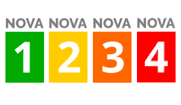

# Nova Web Component

<p align="center">
  
</p>

<p align="center">
  <a href="https://travis-ci.org/vogloblinsky/nutrition-web-components"></a>
  <a href="https://www.browserstack.com/automate/public-build/T3JpQmgwYnd3QVhOTFJOaUVWTU5ici82RTFueDJYemNQbFVZSzd4dzBEcz0tLVJLZXdhc3NWSWgzU04rRkV0SFZvVGc9PQ==--da3c5152d96aadb619e03ad9be536670bcb41111"></a>
  <a href="https://www.npmjs.com/package/@nutrition-web-components/nova"></a>
  <a href="https://opensource.org/licenses/MIT"></a>
</p>

<p align="center">
  
</p>

# Installing the JavaScript Web Component

Link to it by adding the following to your `<head></head>`.

```html
<script src="https://unpkg.com/@nutrition-web-components/nova@x.x.x/dist/nova.js"></script>
```

The `x.x.x` is the specific version of the component, you should use specifc versions to prevent against breaking changes.

# Usage

```html
<nova-badge score="1"></nova-badge>
```

# Integrating with a Framework

This Web Component is build with [Stencil](http://stenciljs.com/) to compile the component into Web Components. And since they can be used within frameworks or in standard HTML websites the best resource to read is the [Stencil documentation](https://stenciljs.com/docs/overview) regarding framework integration.
